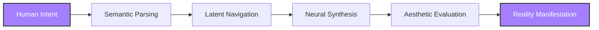

<div align="center">

```
╭─────────────────────────────────────────────╮
│                                             │
│           P R O X Y   N I H I L             │
│                                             │
│    Neural architect • Void engineer        │
│                                             │
╰─────────────────────────────────────────────╯
```

*Where consciousness meets computation*


---

## ⚡ Tech Stack

<table>
<tr>
<td align="center" width="25%">
<h3>🧠 Neural</h3>

<br>
<br>
</td>
<td align="center" width="25%">
<h3>⚛️ Frontend</h3>

<br>
<br>
</td>
<td align="center" width="25%">
<h3>🔧 Backend</h3>

<br>
<br>
</td>
<td align="center" width="25%">
<h3>🎨 Tools</h3>

<br>
<br>
</td>
</tr>
</table>

---

## 🚀 Current Manifestations

<details>
<summary><b>🌌 VisioMera</b> — Neural Interface System</summary>
<br>

> *A portal between human perception and machine intelligence*

**What it does:**
- Real-time visual transformation through custom diffusion pathways
- Adaptive interface that evolves with user interaction patterns
- Multi-modal input processing (text, image, sketch, audio)

**Tech Stack:** Next.js • PyTorch • Custom WebSocket • Vector DBs

**Status:** `90% Complete` • Final integration phase

</details>

<details>
<summary><b>🔮 Void Synthesis Engine</b> — Consciousness Translation</summary>
<br>

> *Transform abstract concepts into visual reality*

**Core Components:**
- Conceptual Parser for semantic analysis
- Latent Navigator for high-dimensional exploration  
- Neural Ensemble with aesthetic biases
- Composition Engine for coherent synthesis

**Research Focus:** Non-euclidean latent spaces • Cross-modal style transfer

**Status:** `85% Complete` • Active research phase

</details>

---

## 🧭 Research Vectors



**Current Explorations:**
- 🌀 Non-euclidean latent space topology
- 🔄 Cross-modal synthesis architectures
- 🎭 Human-machine interface paradigms
- 🎨 Aesthetic evaluation in neural systems

---

## 📊 GitHub Presence


---

## 🌐 Connect to the Network

<a href="https://t.me/Proxy_Nihil_1844_0">

</a>
<a href="mailto:kostopravd@gmail.com">

</a>
<a href="https://github.com/NIHILcoder">

</a>
<a href="https://civitai.com/user/nihiloff">

</a>

---

```
┌─────────────────────────────────────────────────────────────┐
│  "The most profound technologies disappear into the fabric │
│   of reality until they are indistinguishable from it"     │
└─────────────────────────────────────────────────────────────┘
```


</div>
